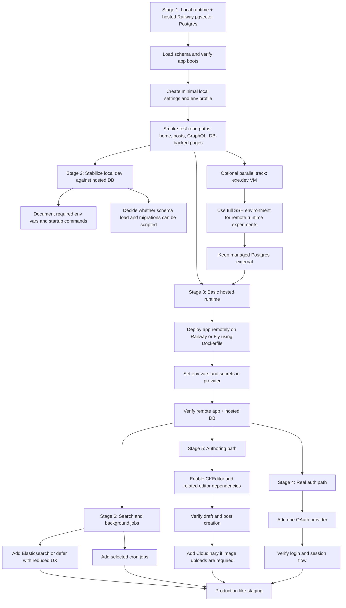

# ForumMagnum Deployment Environment Design

## Goal

Establish the lowest-complexity path to a working ForumMagnum deployment flow, starting with a local application runtime connected to a hosted PostgreSQL instance, and then layering in hosted runtime, authentication, editing, search, and background jobs incrementally.

## Recommendation

Use a staged proof strategy rather than attempting a production-like deployment in one move.

Stage 1 should be:

- Local application runtime
- Hosted PostgreSQL with `pgvector`
- Minimal explicit settings and environment variables
- No real login path
- No Elasticsearch
- No email
- No image uploads
- No CKEditor-dependent authoring validation
- No attempt to reproduce all cron jobs

The recommended hosted database provider for stage 1 is Railway, using its `pgvector` Postgres path. This is the lowest operational-complexity option for the first proof.

## Why This Is The Right First Step

The current repo has three deployment characteristics that make a minimal proof the right first target:

1. The database is a hard dependency.
   The schema requires PostgreSQL extensions including `vector`, `pg_trgm`, `earthdistance`, `intarray`, and `btree_gin`.

2. The existing dev and production flows are environment-specific.
   The dev script pulls environment variables from Vercel, and the production script assumes a private credentials repository.

3. Several integrations are broad but not obviously mandatory for first boot.
   Search, email, Intercom, Cloudinary, OAuth, and language-model features are integrated widely, but the codebase provides configuration seams that make at least some of them deferrable.

This means the first useful question is not "which full platform should host everything?" It is "what is the minimum viable runtime configuration that allows the app to boot and render against a managed database?"

## What Stage 1 Must Prove

Stage 1 succeeds if we can:

- Provision a hosted PostgreSQL database with the required extensions
- Load the checked-in schema
- Supply a minimal local settings and environment profile without Vercel env-pull or the credentials repo
- Start the app locally
- Verify basic DB-backed rendering for a small set of pages and routes
- Record which supposedly optional services actually fail hard at runtime

Stage 1 does not need to prove:

- Real user login
- Post creation
- Rich editor functionality
- Image uploads
- Search indexing
- Background cron coverage
- Production-ready infra automation

## Service Assessment

### Hard Requirements For Stage 1

- Node.js `>=24.13.0`
- PostgreSQL 15+ with `pgvector`
- Direct access to load `schema/accepted_schema.sql`
- `PG_URL`
- `ENV_NAME`
- Minimal settings file derived from `sample_settings.json`
- Minimal private settings, especially a session secret

### Expected To Be Disableable Or Deferred

- Elasticsearch
  The codebase supports `disableElastic=true`, which should allow us to treat search as a later-stage service.
- OAuth providers
  Stage 1 does not need external auth.
- Mailgun
  Email send paths fail soft when Mailgun is not configured.
- Intercom
  The client is only created when the token exists.
- OpenAI and related AI integrations
  These should be treated as feature-specific.
- Cloudinary uploads
  Important for richer authoring, but not required for first boot if we avoid validating upload-heavy flows.

### Likely Stage 2 Or Stage 3 Requirements

- One OAuth provider for login
- CKEditor and related editor token/webhook configuration for full authoring flows
- Cloudinary if image uploads are required
- Elasticsearch if the product must include site search in staging
- Selected cron jobs, prioritized rather than copied wholesale

## Provider Assessment

### Recommended: Railway For Stage 1 Database

Why:

- Lowest operational complexity for the first proof
- Official `pgvector` path exists
- Simple project/service/env model
- Lower startup cost than Fly Managed Postgres
- Good enough to validate the database and config assumptions before any full hosted deployment work

Use Railway first for the database only. Do not treat Railway as permanently selected for the entire stack until the app's minimum runtime shape is proven.

### Strong Later Candidate: Fly.io

Why it matters:

- Strong fit for later stages where app runtime, cron-like workers, and database placement matter together
- Good Dockerfile path
- Better long-term fit if we want app + workers + managed database under one platform model

Why not first:

- Higher cost and more platform surface area than needed for the first proof

### Deferred Candidate: Coolify

Why it matters:

- Explicit API surface for app and database creation
- Strong self-hosted control
- Good Docker Compose support

Why not first:

- Introduces self-hosted platform operations before proving the app can boot cleanly in a reduced-dependency mode

### Appendix Note: exe.dev

`exe.dev` is a useful fallback or parallel option if we want a VM with full SSH access and an AI-assisted DevOps workflow. It is not the default first step for this plan, because the first milestone is specifically about minimizing platform variables. It becomes attractive if we need a remote environment that behaves more like a traditional server while still avoiding local Postgres setup.

## Architecture Direction

The deployment effort should proceed along two tracks:

1. Runtime simplification
   Identify the smallest set of settings, environment variables, and startup steps needed to run the app against a managed database.

2. Platform packaging
   Once local runtime + hosted DB works reliably, package that proven runtime for hosted deployment on Railway or Fly.

This ordering prevents us from conflating application startup failures with platform deployment failures.

## Risks

### Risk: Hidden Mandatory Integrations

Some integrations that look optional may still fail hard during startup or on commonly rendered pages.

Mitigation:

- Treat stage 1 as a discovery exercise with a written runtime matrix
- Verify a narrow set of pages first

### Risk: Dev Startup Assumes Vercel Too Strongly

The default dev script pulls env vars from Vercel. That is the wrong dependency for a self-hosted proof.

Mitigation:

- Add or document a direct local startup path using explicit env vars and a local settings file

### Risk: Schema And Migrations Drift

The checked-in schema and current migrations may not line up perfectly for a blank managed database.

Mitigation:

- Test both schema import and migration execution in stage 1
- Record the authoritative bootstrap sequence

### Risk: Search Is More Central Than Expected

Search is integrated across the codebase.

Mitigation:

- Explicitly disable elastic for stage 1
- Verify that core navigation and rendering still work

## Success Criteria

We can call the design successful when:

- A hosted Postgres instance exists and can be recreated predictably
- The app can run locally against it with explicit local configuration
- We have a short, repeatable bootstrap document or script
- We know which services are actually required for the next stage
- We have a sequenced rollout plan for login, authoring, hosted runtime, search, and cron

## Appendix A: Medium-Term Rollout Diagram

## Appendix B: Initial Evidence Base

- The schema requires PostgreSQL extensions including `vector`
- The current dev script pulls env vars from Vercel
- The production script assumes a private credentials repository
- Search can be disabled via instance settings
- Mailgun and Intercom appear to fail soft when unset
- The repo already includes a Dockerfile, but runtime assumptions still need simplification before hosted deployment work
